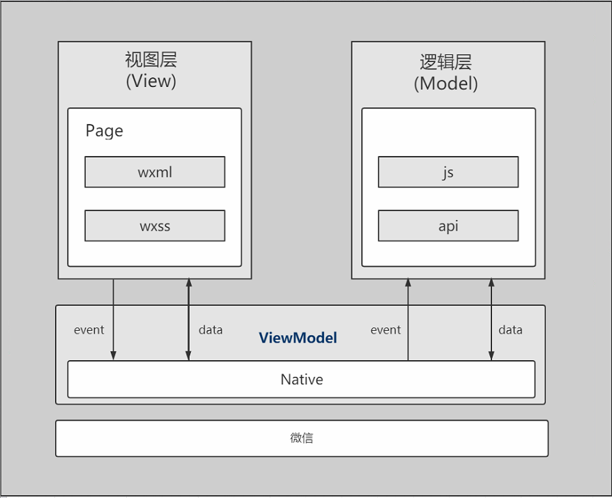

# 微信小程序

微信小程序是一种全新的连接用户与服务的方式，它可以在微信内被便捷地获取和传播，同时具有出色的使用体验。

* 微信

在微信里打开小程序时其实微信会把打包好的代码下载到微信App里，这样就可以像在开发工具里一样在微信里运行小程序了。

* Native层

Native层就是小程序的框架，框架里封装了ui层组件和逻辑层组件，这些组件可以通过微信app提供的接口调用手机硬件信息。

* 视图层和逻辑层

视图层和逻辑层的交互是通过数据经由native层进行交互的。
视图层和逻辑层都可以调用native框架里封装好的组件和方法。
